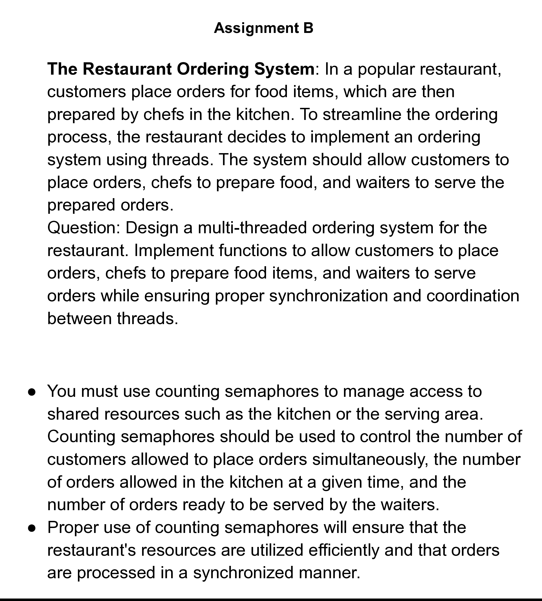

# Multi-threaded Restaurant Ordering System




This project implements a multi-threaded restaurant ordering system designed to simulate the interaction between customers, chefs, and waiters in a busy restaurant environment. The system utilizes POSIX threads for concurrent execution and counting semaphores to manage synchronization and ensure efficient resource utilization.

## Features

- **Thread-based Simulation**: Separate threads simulate customers placing orders, chefs preparing those orders, and waiters serving them.
- **Resource Synchronization**: Uses counting semaphores to manage the number of active threads allowed to perform tasks simultaneously, preventing resource conflicts and ensuring system stability.
- **Efficient Order Processing**: The implementation ensures that orders are processed in a timely and synchronized manner, closely mimicking a real restaurant's operations.

## Getting Started

### Prerequisites

This software requires a GCC compiler with support for POSIX threads. It is intended for use on Unix-like operating systems such as Linux and macOS.

### Building the Project

To compile the application, navigate to the project directory in your terminal and run:

```sh
make
```

This will create an executable named `restaurant_system`.

### Running the Application

Execute the program with:

```sh
./restaurant_system
```

Watch the output in the terminal to see how orders are placed, prepared, and served in a synchronized manner.

## Configuration

The behavior of the system can be modified by adjusting the semaphore counts and thread numbers defined in `restaurant_system.h`. These parameters control the concurrency levels for customers, chefs, and waiters.

## Code Structure

- **main.c**: Sets up the environment, initializes threads, and starts the simulation.
- **restaurant_system.c**: Contains the logic executed by each thread type and the synchronization code.
- **restaurant_system.h**: Defines the interfaces and shared variables for thread functions.
- **makefile**: Provides commands for compiling and cleaning up the project files.

## Detailed Usage

Here’s an example of what the system's output might look like:

```
Customer 1 placed an order.
Chef 0 started cooking order for Customer 1.
Waiter 1 served order for Customer 1.
```

This output reflects the coordinated effort between threads handling different roles within the restaurant.

## Assignment Requirements

This project meets the following specific requirements from the assignment:
- **Counting Semaphores**: Used to control access to shared resources such as the ordering queue and the kitchen, ensuring that the system does not allow more concurrent actions than specified.
- **Multi-threaded Design**: Implements a multi-threaded approach to simulate real-time interactions and processes within a restaurant.

## Contributing

Contributions to this project are welcome. You can contribute by refining the synchronization logic, enhancing the simulation fidelity, or extending the system to include more complex scenarios.
